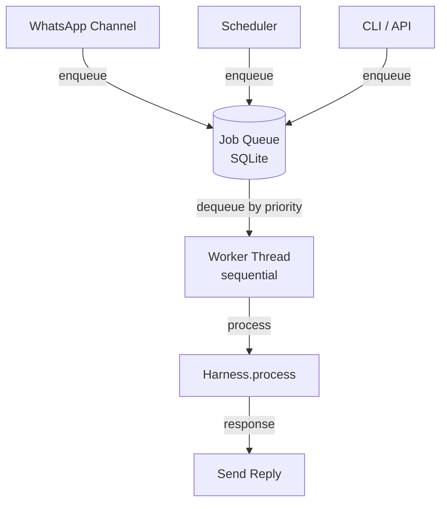
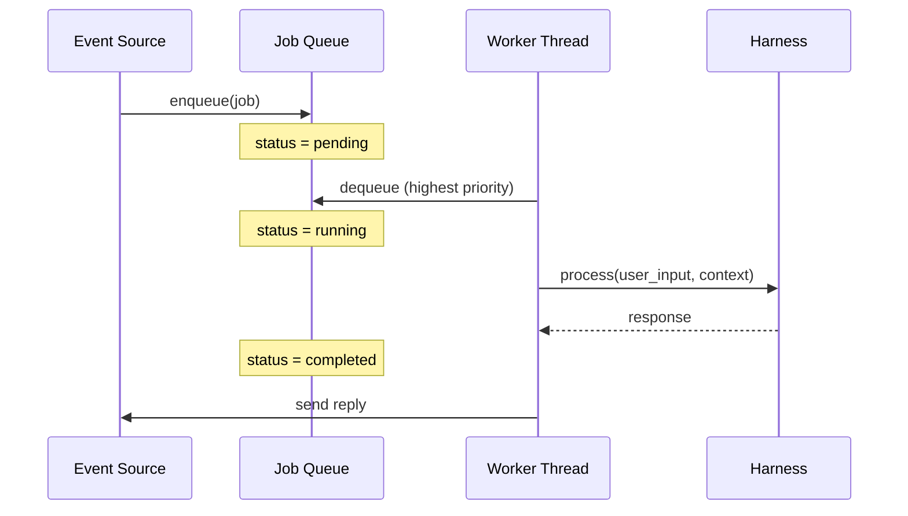
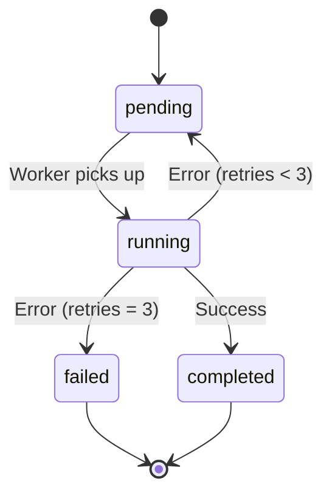

# Job Queue

The job queue enables asynchronous, prioritized task processing. All incoming requests — from WhatsApp, the scheduler, or the CLI — are enqueued as jobs and processed sequentially by a worker thread.

## Architecture



## Job Flow



## Priority Levels

| Priority | Value | Used for |
|----------|-------|----------|
| `urgent` | 10 | System alerts, critical tasks |
| `high` | 7 | WhatsApp voice messages |
| `normal` | 5 | Regular WhatsApp messages |
| `low` | 3 | Scheduled background tasks |

## Jobs Table

```sql
CREATE TABLE jobs (
    id           INTEGER PRIMARY KEY,
    source       TEXT NOT NULL,     -- 'whatsapp', 'scheduler', 'cli'
    priority     INTEGER DEFAULT 5,
    status       TEXT DEFAULT 'pending',  -- pending/running/completed/failed
    payload      TEXT NOT NULL,     -- JSON: {user_input, context}
    created_at   REAL NOT NULL,
    started_at   REAL,
    completed_at REAL,
    retries      INTEGER DEFAULT 0
);
```

## Retry Behavior

Failed jobs are automatically retried up to 3 times with exponential backoff:



