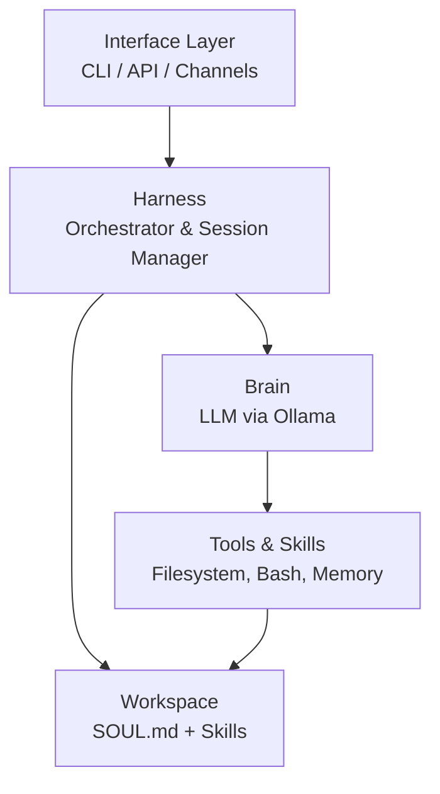

# Architecture Overview

xatrix follows a modular architecture with clear separation of concerns. The system is built around four core components that work together to create a self-improving AI agent.

## System Components



## Core Components

### 1. Interface Layer

Multiple ways to interact with the agent:

- **CLI** (`xatrix.interface.cli`) - Terminal-based chat interface
- **Daemon** (`xatrix.daemon`) - Background service mode
- **Channels** (`xatrix.channels`) - WhatsApp, Telegram, Discord integrations
- **API** - FastAPI REST endpoints (planned)

### 2. Harness (Orchestrator)

**File**: `xatrix/harness.py`

The harness is the heart of xatrix. It:

- **Loads System Prompt** from `workspace/SOUL.md` + active skills
- **Manages Conversation Flow** with session persistence
- **Executes Tool Calls** from the LLM with validation
- **Coordinates Job Queue** for async task processing
- **Protects Core System** - workspace only, no core modifications

:::tip Immutable Core
The harness itself cannot be modified by the agent, ensuring system stability.
:::

### 3. Brain (LLM Interface)

**File**: `xatrix/brain.py`

Abstracts LLM communication:

```python
from xatrix.brain import Brain

brain = Brain()
response = brain.complete(
    messages=[{"role": "user", "content": "Hello"}],
    tools=available_tools,
    stream=True
)
```

**Features:**
- Streaming responses
- Tool-calling support (native function calling)
- Token counting and context management
- Configurable temperature, top-p, etc.

**Current Model**: Qwen3-30B-A3B via Ollama

### 4. Tools & Skills System

**Primitive Tools** (`xatrix/tools/`):
- `filesystem.py` - read, write, edit, list, grep
- `bash.py` - Safe shell command execution (allowlist)
- `memory_tool.py` - Memory storage and retrieval
- `registry.py` - Tool registration and validation

**Skills** (`workspace/skills/`):
- Defined in `SKILL.md` files
- Loaded dynamically into system prompt
- Agent can create new skills
- No code changes needed

## Data Flow

### User Request Flow

```
1. User Input
   ↓
2. Interface → Harness
   ↓
3. Harness constructs context:
   - System prompt (SOUL.md + skills)
   - Conversation history
   - Available tools
   ↓
4. Harness → Brain (LLM)
   ↓
5. Brain returns:
   - Text response, OR
   - Tool call request
   ↓
6. If tool call:
   - Harness validates & executes
   - Result fed back to Brain
   - Loop until final response
   ↓
7. Response → User
```

### Job Queue Flow

For async/long-running tasks:

```
1. User request → Job enqueued
   ↓
2. Worker picks up job
   ↓
3. Worker runs through harness
   ↓
4. Result stored/notified
```

See [Job Queue System](/architecture/job-queue) for details.

## Memory Architecture

**File**: `xatrix/memory/store.py`

SQLite-based persistence:

```
data/
└── agent.db
    ├── conversations      # Chat history
    ├── memories          # User facts, preferences
    ├── skills_cache      # Loaded skill metadata
    └── job_queue         # Async task queue
```

Memory tools allow the agent to:
- Remember user preferences
- Track conversation context
- Store learned information
- Build knowledge over time

## Security Model

### Protected vs. Modifiable

**Protected (Read-only for agent):**
- `xatrix/` - Core Python package
- `bridges/` - Integration services
- System configuration

**Modifiable (Agent can edit):**
- `workspace/` - Skills, SOUL.md, agent data
- `data/` - Database, logs

### Tool Safety

- Bash commands use **allowlist** (grep, ls, cat, etc.)
- Filesystem operations are **sandboxed** to workspace
- No network access tools by default
- All tool calls are **logged**

## Configuration

**File**: `xatrix/config.py`

Centralized configuration with environment variable support:

```python
class Config:
    MODEL_NAME: str = "qwen3:30b-a3b"
    OLLAMA_URL: str = "http://localhost:11434"
    WORKSPACE_DIR: Path = Path("workspace")
    DATA_DIR: Path = Path("data")
    MAX_HISTORY_LENGTH: int = 20
```

## Next Steps

- [Creating Skills](/skills/creating-skills) - Learn how to create custom skills
- [WhatsApp Integration](/integrations/whatsapp) - Set up WhatsApp channel
- [Job Queue System](/architecture/job-queue) - Understand async task processing
