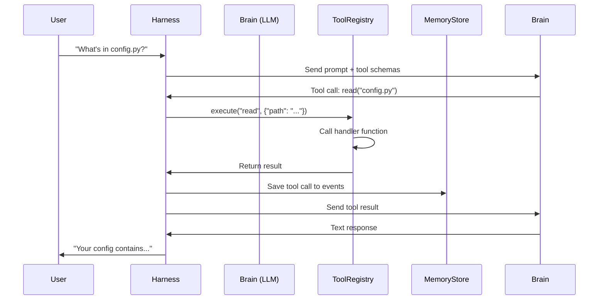

# Tools System

Tools are the primitive actions available to the agent. They provide low-level capabilities that skills can compose into complex behaviors.

## Architecture

**Files**: `xatrix/tools/`

The tools system consists of:
- **Tool Registry** (`registry.py`) - Central registration and execution
- **Tool Definitions** - Individual tool modules (filesystem, bash, memory)
- **Tool Schema** - OpenAI function calling format

```
xatrix/tools/
├── registry.py          # ToolRegistry, Tool, ToolParam classes
├── filesystem.py        # read, write, edit, list, grep
├── bash.py             # Safe shell command execution
├── memory_tool.py      # memory_store, memory_recall, memory_search
└── dynamic_loader.py   # Runtime tool loading
```

## Tool Structure

### Tool Definition

```python
from xatrix.tools.registry import Tool, ToolParam

Tool(
    name="example_tool",
    description="What this tool does",
    parameters=[
        ToolParam("arg1", "string", "Description of arg1"),
        ToolParam("arg2", "integer", "Description of arg2", required=False),
    ],
    handler=example_handler_function
)
```

### Handler Function

```python
def example_handler_function(arg1: str, arg2: int = 10) -> str:
    """Implementation of the tool.
    
    Args:
        arg1: Required string parameter
        arg2: Optional integer parameter
        
    Returns:
        String result of the operation
    """
    result = f"Processed {arg1} with {arg2}"
    return result
```

## Available Tools

### Filesystem Tools

**File**: `xatrix/tools/filesystem.py`

#### `read`
Read file contents:
```python
read(path: str, line_start: int = None, line_end: int = None) -> str
```

Example:
```python
# Read entire file
read("/home/user/project/main.py")

# Read specific lines
read("/home/user/project/main.py", line_start=10, line_end=20)
```

#### `write`
Create or overwrite a file:
```python
write(path: str, content: str) -> str
```

:::danger Destructive Operation
`write` overwrites existing files. Use `edit` for modifications.
:::

#### `edit`
Find-and-replace editing:
```python
edit(
    path: str,
    old_text: str,
    new_text: str,
    occurrence: int = 1
) -> str
```

Example:
```python
edit(
    path="/home/user/config.py",
    old_text='DEBUG = False',
    new_text='DEBUG = True',
    occurrence=1
)
```

#### `list`
List directory contents:
```python
list(path: str, recursive: bool = False) -> str
```

#### `grep`
Search files for patterns:
```python
grep(pattern: str, path: str, file_pattern: str = "*") -> str
```

Example:
```python
# Find all TODO comments
grep("TODO", "/home/user/project", "*.py")
```

### Bash Tools

**File**: `xatrix/tools/bash.py`

#### `bash`
Execute safe shell commands:
```python
bash(command: str, cwd: str = None) -> str
```

**Allowlist** (security):
```python
ALLOWED_COMMANDS = [
    "ls", "cat", "grep", "find", "pwd", "echo",
    "git", "python", "node", "npm", "pip",
    "curl", "wget", "date", "whoami", "uname"
]
```

Example:
```python
# List files
bash("ls -la")

# Run git status
bash("git status", cwd="/home/user/project")

# Check Python version
bash("python --version")
```

:::danger Command Validation
Commands not in the allowlist are rejected. Add to allowlist in `bash.py` if needed.
:::

### Memory Tools

**File**: `xatrix/tools/memory_tool.py`

See [Memory System](/architecture/memory) for detailed documentation.

#### `memory_store`
Store a fact:
```python
memory_store(key: str, value: str, category: str = "general") -> str
```

#### `memory_recall`
Retrieve a fact:
```python
memory_recall(key: str) -> str
```

#### `memory_search`
Search facts:
```python
memory_search(query: str, limit: int = 10) -> str
```

#### `memory_list`
List all facts:
```python
memory_list(category: str = "") -> str
```

#### `memory_delete`
Delete a fact:
```python
memory_delete(key: str) -> str
```

## Tool Registry

**File**: `xatrix/tools/registry.py`

### ToolRegistry Class

Central registry managing all tools:

```python
from xatrix.tools.registry import ToolRegistry

registry = ToolRegistry()

# Register a tool
registry.register(my_tool)

# Get a tool
tool = registry.get("read")

# Execute a tool
result = registry.execute("read", {"path": "/etc/hosts"})

# List all tools
tools = registry.list_tools()

# Get OpenAI schemas for LLM
schemas = registry.to_openai_schemas()
```

### OpenAI Function Calling Format

Tools are automatically converted to OpenAI function calling schema:

```python
{
    "type": "function",
    "function": {
        "name": "read",
        "description": "Read file contents",
        "parameters": {
            "type": "object",
            "properties": {
                "path": {
                    "type": "string",
                    "description": "Path to file"
                },
                "line_start": {
                    "type": "integer",
                    "description": "Start line (optional)"
                }
            },
            "required": ["path"]
        }
    }
}
```

## How Tools Integrate with Memory

Tools and memory work together to provide stateful agent behavior:

### 1. Tool Execution Logging

All tool calls can be logged to the events table:

```python
# In harness.py
result = registry.execute(tool_name, arguments)

# Log the event
memory.log_event(
    event_type="tool_call",
    data={
        "tool": tool_name,
        "arguments": arguments,
        "result": result[:200]  # Truncated
    },
    session_id=current_session
)
```

### 2. Skills Using Memory + Tools

Skills compose memory and filesystem tools:

```python title="Example: Code Review Skill"
# Skill workflow:
1. memory_search("code_style_preferences")  # Check stored preferences
2. read("/path/to/code.py")                # Read the code
3. bash("pylint code.py")                  # Run linter
4. memory_store(                            # Remember issue for future
    "common_issue_indentation",
    "User often has indentation issues",
    "code_patterns"
)
```

### 3. Tool Results in Conversation Context

Tool results are stored in conversation history:

```python
# Conversation flow:
1. User: "What's in config.py?"
2. Agent calls: read("config.py")
3. Tool result: "DEBUG = True\n..."
4. Result saved to: conversations table
5. Agent sees tool result in context
6. Agent response: "Your config has DEBUG=True..."
```

## Creating Custom Tools

### Step 1: Define Handler Function

```python title="xatrix/tools/custom_tool.py"
def my_custom_tool(param1: str, param2: int = 5) -> str:
    """Does something custom."""
    # Implementation here
    return f"Result: {param1} processed {param2} times"
```

### Step 2: Create Tool Definition

```python
from xatrix.tools.registry import Tool, ToolParam

TOOLS = [
    Tool(
        name="my_custom_tool",
        description="Performs a custom operation",
        parameters=[
            ToolParam("param1", "string", "First parameter"),
            ToolParam("param2", "integer", "Repeat count", required=False),
        ],
        handler=my_custom_tool,
    ),
]
```

### Step 3: Register Tool

```python title="xatrix/tools/__init__.py"
from xatrix.tools.custom_tool import TOOLS as CUSTOM_TOOLS

def get_all_tools():
    from xatrix.tools.filesystem import TOOLS as FS_TOOLS
    from xatrix.tools.bash import TOOLS as BASH_TOOLS
    from xatrix.tools.memory_tool import TOOLS as MEMORY_TOOLS
    
    return [
        *FS_TOOLS,
        *BASH_TOOLS,
        *MEMORY_TOOLS,
        *CUSTOM_TOOLS,  # Add your tools
    ]
```

## Tool Execution Flow



## Tool Safety

### Filesystem Sandboxing

Tools are **not** sandboxed to workspace by default - they have full filesystem access. This is intentional for maximum flexibility.

:::warning Security Consideration
The agent can read/write any file the process has permissions for. Run in a container or with restricted user permissions if needed.
:::

### Bash Command Allowlist

Only pre-approved commands can be executed:

```python title="xatrix/tools/bash.py"
ALLOWED_COMMANDS = [
    "ls", "cat", "grep", "find", "pwd",
    "git", "python", "npm", "pip",
    # Add more as needed
]
```

To add a command:
```python
# Edit bash.py
ALLOWED_COMMANDS = [
    # ... existing commands ...
    "your_command",  # Add here
]
```

### Tool Error Handling

All tool errors are caught and returned as strings:

```python
try:
    result = tool.handler(**arguments)
    return str(result)
except Exception as exc:
    logger.exception("Tool error in '%s'", tool_name)
    return f"ERROR: {type(exc).__name__}: {exc}"
```

## Tool Best Practices

### ✅ Do's

- **Keep tools primitive** - One clear purpose per tool
- **Return strings** - All tool handlers return string results
- **Validate inputs** - Check arguments in handler
- **Log to events** - Record important operations
- **Use memory** - Store learned patterns and preferences

### ❌ Don'ts

- **Don't make tools too complex** - Compose via skills instead
- **Don't modify core state** - Tools should be stateless
- **Don't skip error handling** - Always catch exceptions
- **Don't bypass allowlist** - Security is important

## Performance Considerations

### Tool Call Overhead

Each tool call adds:
- LLM inference time
- Tool execution time
- Context token cost

Minimize by:
- Batching operations when possible
- Caching results in memory
- Using efficient tools (grep vs read + search)

### Memory Integration

Tool event logging adds minimal overhead:
- Single INSERT per tool call
- Async logging possible for high-frequency tools

## Next Steps

- [Memory System](/architecture/memory) - Persistent storage details
- [Creating Skills](/skills/creating-skills) - Compose tools into skills
- [Architecture Overview](/architecture/overview) - System architecture
